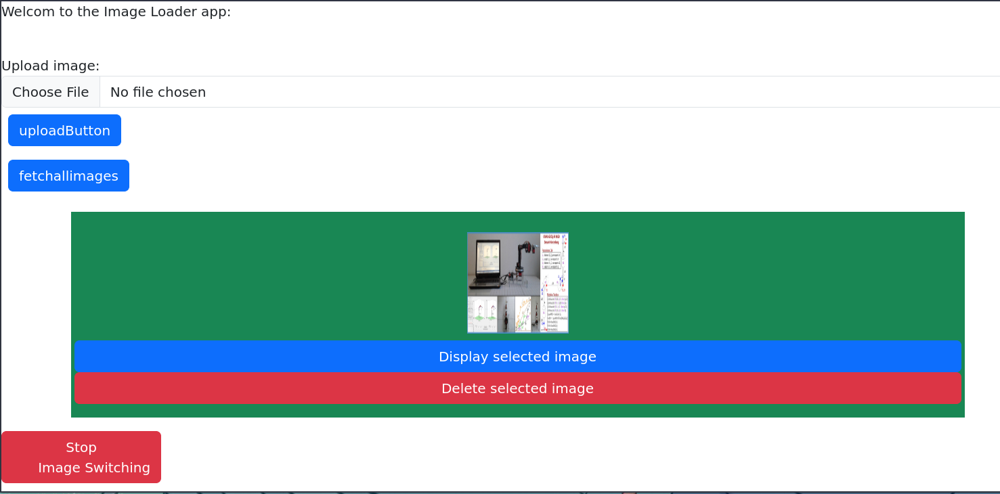

# PI-image-uploader
This is an IoT project: it permits a user to access a web app to upload an image, gif or a panorama and it will be displayed in the screen. 

## Notes 
- The web app is hosted on a webeserver. 
- The webserver will be hosted on the rpi also 
- The display is connected to a rpi via VGA cable 
- The rpi is connected to a local network 
- A service is set to automactically run the backend
- A bash script that will configure, setup and install the application  
## Technologies: 
web dev:

- front end: HTML/CSS/JAVASCRIPT
- back end : flask (python) 

## Walk through the installation script
- Install_dependencies
- Setup_venv
- Update_pythonprog
- Setup_jsfile
- Create_service_file 
- Set_service

## Installation 

1- Clone repo `git clone https://github.com/Onizuka09/PI-image-uploader.git`i

2- `cd PI-image-uploader`, if you have some images you want to set in advance, you can copy the images to `cp images templates/uploads/`

3- run the installation program: `sudo ./install.sh` 

4- visit the website from you phone or your pc by entring "http://ip_address" 

5- to check the service:
* `sudo systemctl status service_name.service`
* `sudo journalctl --follow -u service_name.service`

## Configuration 

To update the ip adress run: `./install.sh setup_jsfile`

## SSH setup to connect to raspberry pi 
1- On your computer network  configuration (ethernet) in IPv4 settings set:

- Method to `Manual`
- click on the add button
- Set an ip (ie: 192.168.0.0)
- Set a gatway (ie: 255.255.255.0)

2- when installing the raspberry pi OS using rpi imager configure `SSH`

3- in the terminal make sure you have SSH install if not (`sudo apt install ssh`) or use a tool like `putty`.

4- attach the ethernet cable to the raspberry pi and your PC 

5- establish connection:
* `ssh pi@raspberrypi.local`
or if you are not able to connect 

* boot to the pi OS get,go to raspi-config: enable ssh, run `hostname -I`: this command will return an ip adress, then connect using: `ssh pi@ip_adress` or `ssh pi@raspberrypi.local`

